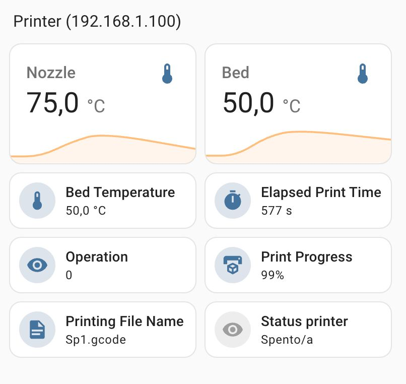
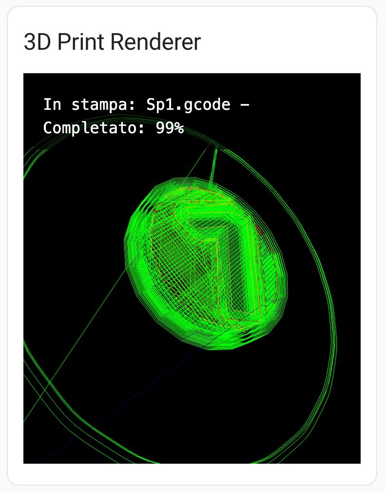

# HAGhost5 - Home Assistant Integration for Flying Bear Ghost 5

HAGhost5 is a custom integration for [Home Assistant](https://www.home-assistant.io/) that brings the Flying Bear Ghost 5 3D printer into your smart home. This integration is designed for printers running the custom firmware developed by [Renzo Mischianti](https://www.mischianti.org/), enabling advanced features and monitoring capabilities.

---

## Features

### 1. **Printer Monitoring**
- Adds sensors to track important parameters during a 3D print, such as:
  - Print progress.
  - Temperature of the hotend and bed.
  - Printer status (idle, printing, error).
  - Remaining time for print completion.
 

### 2. **3D Print Visualization**
- Includes a **custom card** that uses [Three.js](https://threejs.org/) to provide a live visualization of the ongoing print.
- Visualize the G-code layer by layer in 3D as the print progresses.

Experience live G-code visualization during a print:

### 3. **G-code Upload**
- A web-based card provides an easy way to upload G-code files directly to the printer.
- The uploaded files can be visualized in 3D through the integrated custom card.

---

## Installation

### Using HACS (Recommended)
1. Add this repository to your [HACS](https://hacs.xyz/) custom repositories.
2. Search for "HAGhost5" and install it.
3. Restart Home Assistant after installation.

### Manual Installation
1. Download the repository as a ZIP file and extract it.
2. Copy the `haghost5` folder into your Home Assistant `custom_components` directory.
3. Restart Home Assistant.

---

## Configuration

### 1. Add the Integration
- Go to **Settings** → **Devices & Services** → **Add Integration**.
- Search for "HAGhost5" and follow the on-screen instructions.

### 2. Enable the Custom Card
- Add the custom card to your Lovelace dashboard using the YAML configuration provided in the `custom_card` folder.

---

## Links and Resources

- Flying Bear Ghost 5 Firmware: [Renzo Mischianti](https://www.mischianti.org/)
- Home Assistant: [home-assistant.io](https://www.home-assistant.io/)
- Three.js: [threejs.org](https://threejs.org/)
- GitHub Repository: [HAGhost5](https://github.com/mauromorello/HAG5)

---

## Contribution

Contributions are welcome! Feel free to open issues or submit pull requests to improve this integration.

---

## License

This project is licensed under the MIT License. See the [LICENSE](LICENSE) file for details.
